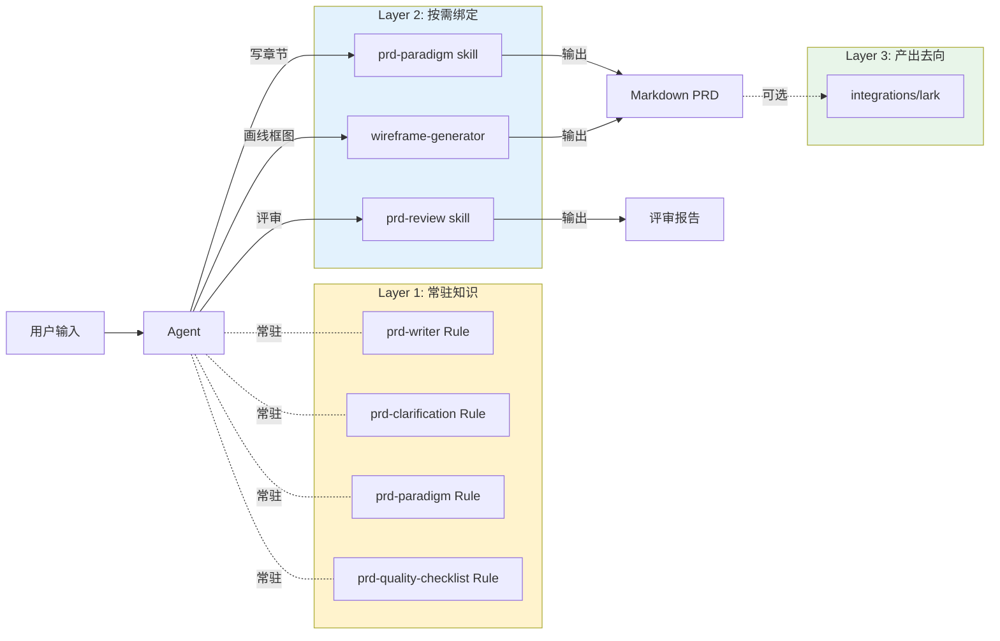

# PRD 工作流

## 编排模型

用户发起 PRD 相关请求 → Agent 在 Rule 常驻上下文的约束下，按情境调用下游 Skill。



## 松耦合

每环可跳过、可替换、可反复。Skill 之间不相互调用，跨 Skill 协作通过 Rule 层发起。

**具体含义**：

1. **Skill 零相互调用**：每个 Skill 的 body 里不出现"执行完后调用 Y Skill"这类硬编码
2. **Rule 描述情境**：`prd-writer.md` 的"工作流编排"段说"什么情境下激活什么能力"，不说"必须按 1→2→3 顺序"
3. **每环可跳过**：用户说"直接用 prd-paradigm 写第三章"时，Agent 不强制走完澄清流程
4. **产出路径不写死**：每个 Skill 都不假设 `docs/business/` 这种具体仓库结构

## 典型场景

### 场景 A：从一句话需求到完整功能 PRD

```
用户："我想做一个每日签到功能"
  ↓
① 按 rules/prd-clarification.md 做 5 维度澄清
     → 输出"需求理解总结"
  ↓
② 激活 prd-paradigm skill
     → 读 rules/prd-paradigm.md + templates/logic-labs-style/feature-prd-10-chapter.md
     → 按 10 章骨架逐章生成
  ↓ （写到"八、原型图"章节）
③ 激活 wireframe-generator skill
     → 从 PRD 文字生成低保真 HTML
  ↓
④ 按 rules/prd-quality-checklist.md 自检
     → 修复 ❌ 项
  ↓
⑤ 激活 prd-review skill（独立评审）
     → 输出结构化修改报告
  ↓
⑥ 根据评审修订，进入 In Review 状态（见 lifecycle/states.md）
  ↓
⑦ integrations/lark/ 推送到飞书文档
```

真实演示见 [examples/daily-signin-feature/](../examples/daily-signin-feature/)。

### 场景 B：按范式补一个功能点

```
用户："给现有 PRD 的规则模块补一个'批量禁用'功能"
  ↓
激活 prd-paradigm skill
  → 按 L2-operational 模板直接写
  ↓
（跳过澄清、跳过评审，由用户自行判断下一步）
```

### 场景 C：只评审不生成

```
用户："评审这份 PRD：path/to/xxx-prd.md"
  ↓
激活 prd-review skill
  → 多轮澄清对话 + 输出修改报告
```

### 场景 D：只画线框图

```
用户："按 PRD 给我生成签到页的线框图"
  ↓
激活 wireframe-generator skill
  → 读 PRD 文字 → 生成 HTML
```

## 生命周期对齐

PRD 在工作流中的状态变化（详见 [lifecycle/states.md](../lifecycle/states.md)）：

| 工作流环节 | PRD 状态 |
|---|---|
| 澄清 + 初版生成 | **Draft** |
| 交 prd-review | **Draft**（仍在写） |
| review 报告回来、修改中 | **Draft** |
| 发给必签 reviewer | **In Review** |
| 签批通过 | **Approved** |
| 推送飞书 + 研发 kickoff | **In Development** |
| 功能上线 | **Shipped**（追加上线小结） |
| 下线或被替代 | **Deprecated** |

## 跨 Agent 场景

本工作流的 Layer 1（知识）不绑定 Claude Code。如果你用 Cursor / ChatGPT / 自建 Agent：

- 复制 `adapters/cursor/.cursorrules` 或 `adapters/generic-system-prompt/prd-writer-system-prompt.md` 到目标系统
- 该 Agent 会获得与 Claude Code 同样的 PRD Writer 知识
- 区别：没有 `skills/` 的工作流编排 → 需要更多手动引导
- `templates/` 和 `rules/` 依然可读

详见 [integration-guide.md](integration-guide.md)。

## 常见问题

**Q：为什么没有单独的"clarification skill"？**

A：v0.1 曾有，v0.2 升格为 `rules/prd-clarification.md`。理由：澄清是方法论（跨 Agent 通用），不是 Claude Code 专用 workflow。升格后 Cursor 用户也能用。

**Q：prd-self-checker 去哪了？**

A：v0.1 的 self-checker 和 prd-review 共享同一份 6 维度判据，职责过度重叠。v0.2 把判据合并进 `rules/prd-quality-checklist.md`，自检与评审用同一份 Rule。

**Q：paradigm 既是 Rule（`rules/prd-paradigm.md`）也是 Skill（`skills/prd-paradigm/`），两者差别？**

A：
- Rule 层 `prd-paradigm.md`：范式定义（Always/Ask/Never 硬规则 + 章节结构）—— 纯知识，agent-neutral
- Skill 层 `prd-paradigm/SKILL.md`：Claude Code 的触发绑定 —— 薄壳，引用 Rule + templates 执行

分工清晰：Rule 讲"是什么"，Skill 讲"Claude Code 怎么触发怎么做"。

**Q：如果我团队的 PRD 不用 10 章骨架？**

A：fork 本仓库，改 `templates/` 和 `rules/prd-paradigm.md`。其他 Rule（prd-writer / prd-clarification / prd-quality-checklist）都是通用的，可以保留。

**Q：工作流能否自动化？**

A：当前版本是"Agent 按情境判断"。未来可以加 Claude Code Hooks 实现（如"PRD 文件保存后自动 run prd-review"），或加脚本做 Git 钩子。v0.2 不做。
