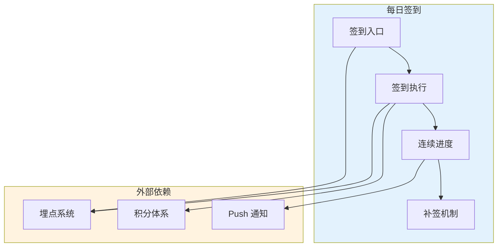

# 每日签到 PRD v0.1

> 功能级 PRD，按 `templates/logic-labs-style/feature-prd-10-chapter.md` 骨架生成。
> 基于 [01-clarification.md](01-clarification.md) 的需求理解总结。

---

## 一、产品背景与问题

### 1.1 背景

近三个月，平台新用户次周留存率从 28% 跌到 22%，是 Q2 的首要 OKR 缺口。用户运营团队的定性反馈显示：新用户注册后第 3–7 天是流失高峰，缺少"回来一下"的轻量动机。老用户流失则集中在近 7 天未登录的群体。

### 1.2 要解决的问题

**缺少一个让用户每天有动机打开 App 的钩子。**

签到机制在抖音、得物等 App 已被验证——低成本、低认知负担、养成习惯。本功能引入签到作为日常回访的基础设施，配合现有积分体系，提供一个无现金成本的激励方案。

### 1.3 本次不做的

- 社交分享（"分享到朋友圈得双倍积分"）
- 组队签到（"和朋友一起连续 7 天"）
- 排行榜（"本周签到榜 top 100"）

以上留给 MVP 上线后、看数据决定是否加。

---

## 二、目标用户与场景

### 2.1 目标用户

| 角色 | 描述 | 本功能对他们的价值 |
|---|---|---|
| **新注册用户** | 注册 ≤ 7 天，正在认识产品 | 低门槛回访动机，帮助养成习惯 |
| **活跃用户** | 近 7 天有登录 | 每日积分进账，延长使用时长 |
| **沉默用户** | 近 7 天未登录但未流失 | 看到"连续签到进度要断"时回流 |

### 2.2 核心场景

**场景 1：新用户第 3 天的回访动机**
- 情境：张三注册 2 天，对 App 价值还没完全理解，正犹豫要不要继续用
- 动作：收到推送"签到得 10 积分"，点击打开 App，完成签到
- 期望：积累 3 天进度后，张三开始对"连续签到"产生沉没成本，形成习惯

**场景 2：沉默用户的"进度保护"召回**
- 情境：李四连续签到 15 天后中断 3 天，今天即将错过第 4 天
- 动作：Push 提示"免费补签本周还剩 1 次，用了吗？"，点击补签
- 期望：李四通过补签救回进度，避免完全流失

---

## 三、用户故事

每条对照 INVEST 自检通过。

- 作为**新用户**，我希望**在首页看到一个明显的签到入口**，以便**养成每天打开 App 的习惯**
- 作为**活跃用户**，我希望**每天签到能得积分**，以便**在现有积分体系里兑换我想要的权益**
- 作为**沉默用户**，我希望**连续签到中断时有一次免费补签的机会**，以便**不因一两天缺席而放弃整个进度**
- 作为**产品经理**，我希望**能在后台看到签到相关的核心指标**，以便**判断功能是否达到次周留存目标**

---

## 四、功能模块详述

### 4.1 功能架构总览



### 4.2 签到入口模块

#### 模块概述

首页固定位展示 **签到按钮（Sign-in Button）**，按钮状态根据用户当天是否已签到动态变化。入口是所有签到动作的唯一触发点。

#### 功能详述

**签到按钮**（页面型）

- 位置：首页顶部 banner 下方，固定可见
- 未签到态：按钮文案"签到得 10 积分"，带红点
- 已签到态：按钮文案"已签到 X 天"，红点消失
- 加载态：骨架屏，避免闪烁
- **空状态**：标题"还没签过"，描述"每天签到得积分，兑换好礼"

**触发方式**：
- 用户点击按钮 → 进入签到执行（模块 4.3）

**展示规则**：
- 每日 00:00 刷新按钮状态
- 首次进入 App 检测当天状态

#### 与其他模块的关系

- 依赖：模块 4.3（签到执行）
- 被依赖：无
- 数据流向：读取"当天是否已签到"状态 → 决定 UI 呈现

### 4.3 签到执行模块

#### 模块概述

用户点击签到按钮后的核心动作：**记录签到、发放积分、更新连续天数**。本模块是所有副作用的发生地。

#### 功能详述

**执行签到**（操作型）

**触发方式**：用户在未签到状态下点击签到按钮

**字段表**（无用户输入，系统自动执行）：

系统自动处理：
- 当前日期（精确到日，按用户时区）
- 用户 ID
- 签到奖励积分数（固定 10 积分，MVP）
- 连续签到天数（从模块 4.4 读取）

**成功路径**：
1. 签到记录写入成功
2. 积分体系发放 10 积分
3. 连续签到天数 +1
4. 前端弹出 Toast："签到成功 +10 积分，连续 N 天"
5. 按钮变为"已签到 N 天"

**失败路径**：
- 积分发放失败 → 回滚签到记录 → Toast "签到失败，请稍后再试"
- 同一天重复点击 → 幂等处理，直接显示"已签到 N 天"

#### 与其他模块的关系

- 依赖：模块 4.4（读取连续签到天数）、外部积分体系
- 被依赖：模块 4.1（签到入口要回显已签到状态）
- 数据流向：写入"签到记录"→ 触发"积分发放"→ 更新"连续签到天数"

### 4.4 连续进度模块

#### 模块概述

维护每个用户的**连续签到天数（Consecutive Sign-in Days）**。签到时 +1，中断时置零（但先给补签机会，见模块 4.5）。

#### 功能详述

**连续天数计算**（执行型）

**触发方式**：每日 00:05 定时任务扫描所有用户

**执行逻辑**：
- 若用户昨日已签到且今日未签到 → 状态保持"连续中，今日待签"
- 若用户昨日未签到且今日未签到 → 触发补签检查（模块 4.5）
- 若补签检查通过 → 保留连续进度
- 若补签检查失败 → 连续天数置零

**展示规则**：
- 在签到按钮旁小字显示"已连续 N 天"
- 连续 7 天、30 天、100 天给成就徽章（MVP 不做，标为 P2 进第七章）

#### 与其他模块的关系

- 依赖：模块 4.3（读签到记录）、模块 4.5（判断是否补签）
- 被依赖：模块 4.1、模块 4.3
- 数据流向：读"每日签到记录"→ 计算"连续天数"

### 4.5 补签机制模块

#### 模块概述

每周给用户 **1 次免费补签（Free Retroactive Sign-in）**的机会。用于救回中断的连续进度。

#### 功能详述

**执行补签**（操作型）

**触发方式**：用户在"已中断但仍在补签窗口内"的状态下，点击首页签到按钮

**字段表**（无用户输入）：

系统自动处理：
- 本周免费补签次数剩余（读取"本周补签次数"字段）
- 补签的目标日期（默认补昨天）

**成功路径**：
1. 补签次数 -1
2. 补签日的签到记录写入
3. 积分补发 10 积分
4. 连续签到天数保留（从中断前的数字继续）
5. Toast "补签成功，连续进度已保留"

**失败路径**：
- 本周补签次数用完 → Toast "本周免费补签已用完，连续进度归零"，然后模块 4.4 置零天数
- 补签的日期超过 7 天 → 不支持，同上

#### 与其他模块的关系

- 依赖：模块 4.3（发放积分）、模块 4.4（保留连续天数）
- 被依赖：无
- 数据流向：更新"本周补签次数"

---

## 五、业务规则

| 编号 | 规则描述 | 适用范围 |
|---|---|---|
| BR-001 | 签到奖励为 10 积分（固定），MVP 不区分新老用户 | 模块 4.3 |
| BR-002 | 同一自然日用户只能签到 1 次（幂等） | 模块 4.3 |
| BR-003 | 每周免费补签 1 次，按自然周重置（周一 00:00） | 模块 4.5 |
| BR-004 | 补签仅支持最近 7 天内的日期 | 模块 4.5 |
| BR-005 | 连续签到中断且无补签次数 → 下次签到从"连续 1 天"重新开始 | 模块 4.4 |
| BR-006 | 时区统一用服务端时区（假定北京时间），用户出境不影响 | 全局 |

---

## 六、指标体系

### 6.1 北极星指标

| 指标 | 基线 | 目标 | 测量周期 | 数据源 |
|---|---|---|---|---|
| 次周留存率 | 22% | 24%（+2pp） | 周 | 埋点"登录"+ 后端计算（新注册后第 7–14 天的登录率） |

### 6.2 输入指标（3 个）

| 指标 | 基线 | 目标 | 测量周期 | 数据源 |
|---|---|---|---|---|
| 签到按钮日 CTR | [待上线后测] | ≥ 35% | 日 | 埋点"签到按钮点击" / 首页曝光 |
| 签到完成率 | [待上线后测] | ≥ 90% | 日 | 埋点"签到完成" / 埋点"签到按钮点击" |
| 7 日连续签到率 | [待上线后测] | ≥ 15% | 周 | 后端计算（连续天数 ≥ 7 的用户数 / 签到过的用户数） |

### 6.3 护栏指标（2 个）

| 指标 | 基线 | 阈值 | 测量周期 | 数据源 |
|---|---|---|---|---|
| 签到接口 P95 延迟 | [待上线后测] | < 300ms | 日 | 后端监控 |
| 积分体系 QPS 峰值 | 现系统 Q | < 3Q（不能超过 3 倍） | 日 | 后端监控 |

---

## 七、验收标准（Gherkin）

### 7.1 签到入口（模块 4.1）

```gherkin
# Happy Path
Given 用户当日未签到
When  用户进入首页
Then  签到按钮显示"签到得 10 积分"，带红点

# Edge Case：新用户首次打开
Given 用户是新注册且从未签过到
When  用户进入首页
Then  签到按钮显示"签到得 10 积分"，带红点；下方显示"还没签过，每天签到得积分"

# Error Path：用户状态接口失败
Given 用户状态接口超时或 5xx
When  用户进入首页
Then  签到按钮显示骨架屏，不展示红点；接口恢复后再刷新
```

### 7.2 执行签到（模块 4.3）

```gherkin
# Happy Path
Given 用户当日未签到，连续签到 5 天
When  用户点击签到按钮
Then  Toast "签到成功 +10 积分，连续 6 天"；按钮变为"已签到 6 天"；积分余额 +10

# Edge Case：快速连点
Given 用户当日未签到
When  用户在 1 秒内点击签到按钮 3 次
Then  仅第一次生效；后两次前端抖动拦截或后端幂等返回同一结果

# Error Path：积分发放失败
Given 用户当日未签到
When  用户点击签到 + 积分发放接口返回失败
Then  回滚签到记录；Toast "签到失败，请稍后再试"；连续天数不变
```

### 7.3 补签（模块 4.5）

```gherkin
# Happy Path
Given 用户中断签到 1 天，本周还有 1 次免费补签
When  用户今日点击签到按钮
Then  Toast "补签成功，连续进度已保留"；补签次数减 1；连续天数继续累加

# Edge Case：本周补签已用完
Given 用户中断签到 1 天，本周 0 次免费补签
When  用户今日点击签到按钮
Then  Toast "本周免费补签已用完"；连续天数归零；按钮状态变为"已签到 1 天"

# Error Path：补签日期超过 7 天
Given 用户上次签到是 10 天前
When  用户今日点击签到按钮
Then  不走补签逻辑；连续天数归零；按钮状态变为"已签到 1 天"
```

---

## 八、原型图

### 8.1 首页 — 签到按钮位置与三态

- **未签到态**：首页 banner 下方显眼位置，红点提示，文案"签到得 10 积分"
- **已签到态**：按钮变为绿色对勾，文案"已签到 X 天"，小字"连续 X 天"
- **补签窗口态**：按钮文案"今日可补签，本周还有 1 次免费补签机会"


### 8.2 签到成功 Toast

- 中央 Toast 浮层，自动消失 2 秒
- 内容："签到成功 +10 积分，连续 N 天"
- 背景半透明深色


> 图未画，上线前由设计出，PM 负责根据线框图产出需求。

---

## 九、追溯矩阵

| 问题 ID | Outcome | 功能点 | AC ID | 指标 |
|---|---|---|---|---|
| P-001：新用户缺少每日回访动机 | 新用户养成打开 App 习惯 | 签到入口（模块 4.1）+ 签到执行（4.3） | AC-7.1.1 / AC-7.2.1 | 签到按钮 CTR ≥ 35%；签到完成率 ≥ 90% |
| P-002：沉默用户因进度中断放弃 | 补签让用户救回进度 | 补签机制（模块 4.5） | AC-7.3.1 | 7 日连续签到率 ≥ 15% |
| P-003：次周留存 22% 低于目标 28% | 签到习惯提升次周留存 | 综合（模块 4.1–4.5） | 全部 AC | 次周留存 22% → 24% |

---

## 十、风险 · 依赖 · 开放问题

### 10.1 风险与假设

| 风险/假设 | 影响 | 判定条件 | 应对 |
|---|---|---|---|
| [假设] 积分奖励足够撬动留存 | 若不成立，本功能无效 | 上线 4 周后签到按钮 CTR < 10% | 改激励形式（加现金红包 / 实物奖品） |
| [假设] 后端积分系统承载 10x QPS | 若不成立，签到会导致积分体系雪崩 | 压测 3x QPS 失败 | 改异步发放 + 队列削峰 |
| 风险：时区问题 | 用户跨时区签到可能多签 | 发现用户一天签两次 | MVP 只看服务端时区，P2 改用户本地时区 |

### 10.2 外部依赖

| 依赖 | 说明 | 需要对齐的角色 |
|---|---|---|
| 积分体系接口 | 发放 / 回滚 / 查询 | @后端架构师 |
| 埋点系统 | 新增 3 个埋点事件 | @数据工程师 |
| Push 通知 | 补签提醒 Push 模板 | @运营 |
| 首页 UI 位置 | 签到按钮占位需与 banner / 其他入口协调 | @首页负责人 |

### 10.3 开放问题（需要确认后才能动工）

- [ ] 签到奖励是固定 10 积分，还是连续天数翻倍（如第 7 天得 70 积分）？（owner：@运营）
- [ ] 补签次数按自然周还是滚动 7 天？（owner：PM 自己）
- [ ] 跨天签到的时区策略 MVP 就要还是可留 P2？（owner：@后端架构师）
- [ ] 成就徽章 / 连续 7/30/100 天奖励 MVP 要不要？（owner：@运营 + 本 PM）

---

## 七、未来规划

以下均为 P2，本 MVP 不做：

- 连续 7/30/100 天成就徽章
- 排行榜（本周签到榜）
- 社交分享（分享得双倍积分）
- 组队签到
- 按用户等级差异化奖励
- 广告激励补签（看广告换补签次数）
