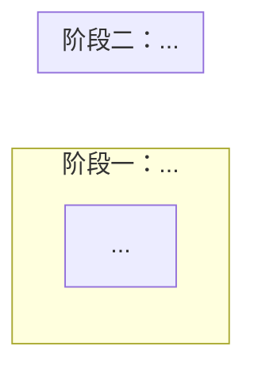
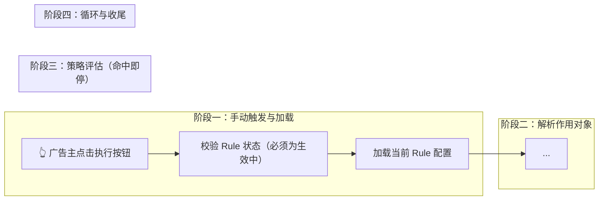

# 形态 C：执行型功能模板

适用：手动执行 / 批处理 / 循环任务 等"多步骤 + 异常分支 + 需要流程图"的功能。

## 模板

````markdown
**{功能名称}**

- 触发方式：{入口}
  - 前置条件：{可选子 bullet}
- 执行规则：
  1. {步骤一}
  2. {步骤二}
  3. {步骤三（含异常分支描述）}
  4. {循环处理}



- 提交结果状态：
  - 成功：{任务启动并完成，相应反馈}
  - 失败：{任务启动失败，错误提示}
- 约束与边界：
  - 业务边界：{MVP 范围内不支持什么}
  - 数据影响：{执行结果对数据的后果 / 是否可回滚}
````

## 要素说明

### 「执行规则」编号步骤
- 用有序列表（1. 2. 3.）
- 每步一个动作 + 可能的异常分支
- 循环 / 重试逻辑单独成一步
- 所有"失败如何处理"、"报错如何跳过"必须在步骤里说清楚，**不得塞入容错规则或约束**

### 「异常分支」写法
子 bullet 列出该步骤可能的分支：

```markdown
  3. 策略评估：对每个 **Target Object**，按 **执行顺序** 依次评估 **条件**
     - 条件为真：执行对应动作，跳过剩余 **Strategy**
     - 条件为假：评估下一条 **Strategy**
     - 条件评估报错：跳过该 **Target Object**，处理下一个
     - 全部 Strategy 未命中：不做任何变更
```

### Mermaid 流程图（必须有）
- 固定用法：`flowchart LR` 外层 + `subgraph [direction TB]` 分阶段
- 阶段数量 = 执行规则的主要阶段（如触发 → 加载 → 处理 → 收尾 = 4 个 subgraph）
- 节点文字必须与正文术语完全一致（mermaid 节点 ≡ 正文）
- 颜色样式见 `references/mermaid-styles.md`

### 「提交结果状态」
执行型只有两个分支：
- **成功**：任务启动并跑完
- **失败**：任务启动失败（含鉴权失败、前置条件检查失败等）

运行中的每步异常不在此处列，已在「执行规则」步骤内说明。

### 「约束与边界」
执行型功能**几乎总是**会有数据影响（写外部系统、调 API），所以这一节通常要写。业务边界也经常有（例："MVP 不支持定时触发"）。

## 正例（摘自 `rule-management-prd-v2.md`）

````markdown
**Rule 手动执行**

- 触发方式：在 **Rule 列表页** 的某条 **Rule** 上或 **Rule 详情页** 点击 "Run" 按钮
  - 前置条件：**规则状态** 为"生效中"才可触发执行；"未生效"的 **Rule** "Run" 按钮置灰不可点击
- 执行规则：
  1. 加载配置：读取该 **Rule** 当前最新配置及其下全部 **Strategy**
  2. 解析作用对象：按 **作用层级** 从绑定的 **Ad Account** 获取全部 **Target Object**；获取失败则终止执行并在页面提示错误
  3. 策略评估：对每个 **Target Object**，按 **执行顺序** 依次评估 **条件**
     - 条件为真：通过 Meta Marketing API 执行对应 **动作**，跳过剩余 **Strategy**（动作成功 / 失败均停止评估）
     - 条件为假：评估下一条 **Strategy**
     - 条件评估报错：跳过该 **Target Object**，处理下一个 **Target Object**
     - 全部 Strategy 未命中：不对该 **Target Object** 做任何变更
  4. 循环处理：重复第 3 步直至所有 **Target Object** 完成；单条 **Target Object** 的异常（条件报错 / 动作失败）均不重试、不阻塞后续 **Target Object**



- 提交结果状态：
  - 成功：任务启动并完成所有 **Target Object** 的处理
  - 失败：任务启动失败（如鉴权失败），页面顶部显示错误提示
- 约束与边界：
  - 业务边界：MVP 仅支持手动触发，不支持定时 / 事件驱动触发
  - 数据影响：执行过程中通过 Meta Marketing API 对 **Target Object** 做的 **动作** 不可回滚
````

要点注解：
- 前置条件在触发方式下 → 不重复写到约束与边界
- 执行规则每一步都含异常分支，不外包到"容错规则"
- Mermaid 阶段数量 = 执行规则的主要阶段数（4 步 ↔ 4 个 subgraph）
- 提交结果状态只有 2 个分支（成功 / 失败），运行中的异常已在步骤里说清
- 约束与边界两类齐全：业务边界（不支持定时）+ 数据影响（不可回滚）

## 反模式（严禁出现）

- ❌ 无 mermaid 流程图
- ❌ Mermaid 节点文字与正文术语不一致
- ❌ 异常分支散落到"容错规则"或单独章节（必须写进对应步骤的子 bullet）
- ❌ 「提交结果状态」列出运行中的每个异常分支（应归入执行规则）
- ❌ 约束与边界混入前置条件 / 外部依赖
- ❌ 前置条件既写在触发方式里又写在约束与边界里
