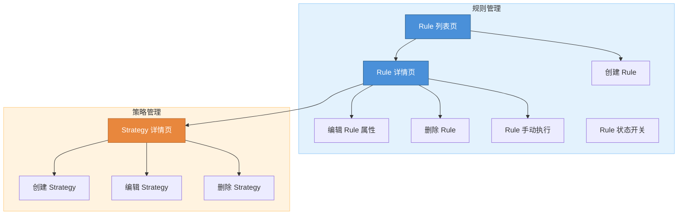
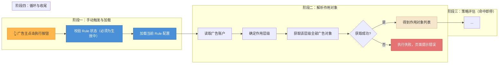

# Mermaid 样式约定

PRD 里 mermaid 只有两种用法：**架构图**（第三章 · 功能架构总览）与**流程图**（执行型功能的执行规则段落）。固定语法 + 固定配色，不随性发挥。

## 一、架构图（`graph TD`）

### 用法

- 出现在：第三章 · 功能架构总览
- 目的：把本 PRD 的模块 / 功能点画成有向图，subgraph 分模块 + 上色

### 语法骨架

````markdown

````

### 必守规则

1. **`graph TD`** —— 自顶向下
2. 每个模块用 `subgraph` 包裹，subgraph 名称用中文
3. 节点 ID 用全大写 + 下划线（`R_LIST`），节点文字用中文
4. 节点文字必须等于正文对应功能点的名称（一字不差）
5. 所有 subgraph 必须上色（`style {模块} fill:... stroke:...`）
6. 关键入口节点（列表页 / 详情页）用深色 + 白字强调

## 二、流程图（`flowchart LR`）

### 用法

- 出现在：执行型功能的「执行规则」段落
- 目的：把多步骤执行逻辑（触发 → 处理 → 收尾）可视化

### 语法骨架

````markdown

````

### 必守规则

1. **外层固定 `flowchart LR`**（从左到右），内部 subgraph 用 `direction TB` 改成自上而下
2. 每个阶段一个 subgraph，命名 `"阶段一：xxx"` / `"阶段二：xxx"`
3. 判断节点用菱形 `{"...?"}`，动作节点用矩形 `["..."]`
4. 分支边用中文标签：`-- "是" -->` / `-- "否（数据不可用）" -->`
5. 节点文字必须等于执行规则步骤中的措辞
6. 错误 / 失败节点必须上红色 `fill:#E57373,stroke:#C62828,color:#fff`

## 三、统一配色

### 架构图

| 场景 | fill | stroke | color |
|---|---|---|---|
| 模块 subgraph（浅底） | `#E3F2FD` / `#FFF3E0` | `#90CAF9` / `#FFCC80` | 默认 |
| 主入口节点（列表 / 详情） | `#4A90D9` | `#2C5F8A` | `#fff` |
| 次要模块入口 | `#E8873D` | `#B5682E` | `#fff` |
| 普通功能节点 | `#E3F2FD` | `#90CAF9` | `#333` |

### 流程图

| 场景 | fill | stroke | color |
|---|---|---|---|
| 用户触发节点 | `#FFB74D` | `#F57C00` | `#333` |
| 系统处理节点 | `#4A90D9` | `#2C5F8A` | `#fff` |
| 数据 / 成果节点 | `#F5E6CC` | `#C8A96E` | `#333` |
| 失败 / 错误节点 | `#E57373` | `#C62828` | `#fff` |
| 成功结束节点 | `#81C784` | `#2E7D32` | `#fff` |

## 四、反模式（严禁出现）

- ❌ 架构图用 `graph LR`（应统一 TD）
- ❌ 流程图无 subgraph 分阶段
- ❌ subgraph 无颜色
- ❌ 节点 ID 混用中英文 / 混用大小写
- ❌ 节点文字与正文术语不一致（出现「按创建时间升序」而正文写「按执行顺序」这类）
- ❌ 判断节点用矩形 / 动作节点用菱形（反了）
- ❌ 分支边标签用英文（应中文）
- ❌ 失败节点不上红色
- ❌ 在架构图里夹入流程细节，或在流程图里塞架构关系

## 五、一致性自检

每次改 mermaid 后，扫一遍：

- 所有节点文字能在正文中 `grep` 到同名术语
- 所有 subgraph 都有 `style` 行
- 判断节点 `{"...?"}` 与动作节点 `["..."]` 未混用
- 分支标签全中文
- 失败节点已染红
