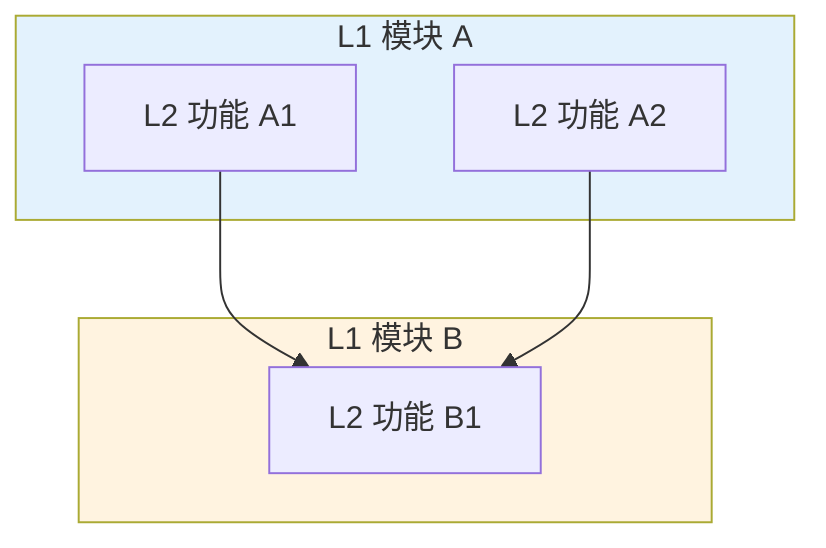

# {模块名称}管理 PRD

> 复制本文件为起点，按章节填写。规则见 `rules/prd-paradigm.md`。

---

## 一、产品背景与目标

### 1.1 背景与问题陈述

{一段话，说明：
- 当前业务存在的具体问题或痛点（可用数据量化）
- 现有方案为什么不足以解决
- 本模块要切入的角度}

### 1.2 产品目标

≤ 3 条可量化目标：

1. {目标 1，含可度量的具体值}
2. {目标 2}
3. {目标 3}

---

## 二、用户故事与功能需求

### 2.1 目标用户画像

| 角色 | 描述 | 核心诉求 |
|---|---|---|
| {角色 A} | {定义} | {诉求} |
| {角色 B} | {定义} | {诉求} |

### 2.2 用户故事

按模块分组：

**{L1 模块 A}**
- 作为 {角色}，我希望 {Y}，以便 {Z}
- 作为 {角色}，我希望 {Y}，以便 {Z}

**{L1 模块 B}**
- 作为 {角色}，我希望 {Y}，以便 {Z}

### 2.3 功能需求清单

| 优先级 | 功能名称 | 功能简述 |
|---|---|---|
| P0 | {功能 A} | {一句话} |
| P0 | {功能 B} | {一句话} |
| P1 | {功能 C} | {一句话} |

> P2 请塞进第七章"未来规划"。

---

## 三、功能模块详述

### 3.1 功能架构总览

> 术语必须与正文一致；样式见 `templates/logic-labs-style/mermaid-styles.md`。

### 3.2 {L1 模块 A}

#### 模块概述

{3–5 句：在业务链路中的定位 / 与兄弟模块的层级关系 / 操作入口}

#### 功能详述

按 L2 形态套用模板：

- **{L2 功能 A1}** → 套 `L2-operational.md` / `L2-page.md` / `L2-execution.md`
- **{L2 功能 A2}** → 套模板

#### 与其他模块的关系

- 依赖：{上游模块}
- 被依赖：{下游模块；MVP 无下游写 "MVP 阶段无下游依赖"}
- 数据流向：{关键关系}

### 3.3 {L1 模块 B}

{同上}

---

## 四、业务规则

跨模块约束集中在此：

| 编号 | 规则描述 | 适用范围 |
|---|---|---|
| BR-001 | {规则} | {模块 A / 模块 B} |
| BR-002 | {规则} | {适用范围} |

> 模块内的规则留在第三章对应小节，不重复展开。

---

## 五、原型图

### 5.1 {页面 A}

{页面用途说明}

### 5.2 {页面 B}

{说明}

---

## 六、业务对象梳理

详见 [./{module}-business-objects.md](./{module}-business-objects.md)。

---

## 七、风险与依赖

### 7.1 主要风险

| 风险 | 影响 | 应对措施 |
|---|---|---|
| {风险 1} | {影响面} | {具体措施} |
| {风险 2} | {影响面} | {具体措施} |

### 7.2 外部依赖

| 依赖 | 说明 |
|---|---|
| {依赖 1} | {接口/系统/团队} |
| {依赖 2} | {说明} |

### 7.3 未来规划（可选）

MVP 外的 P2 功能：

- {功能 X}（P2）
- {功能 Y}（P2）
